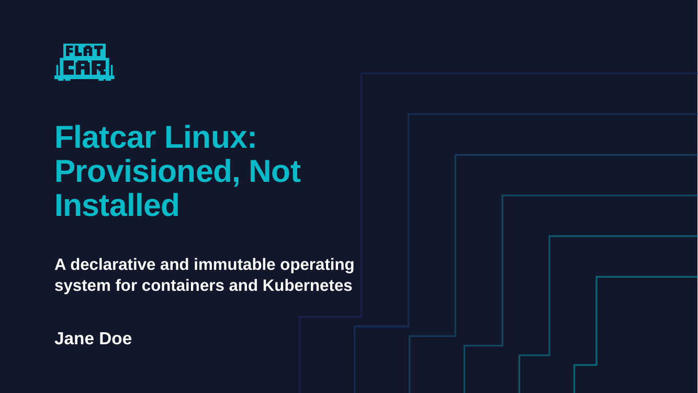
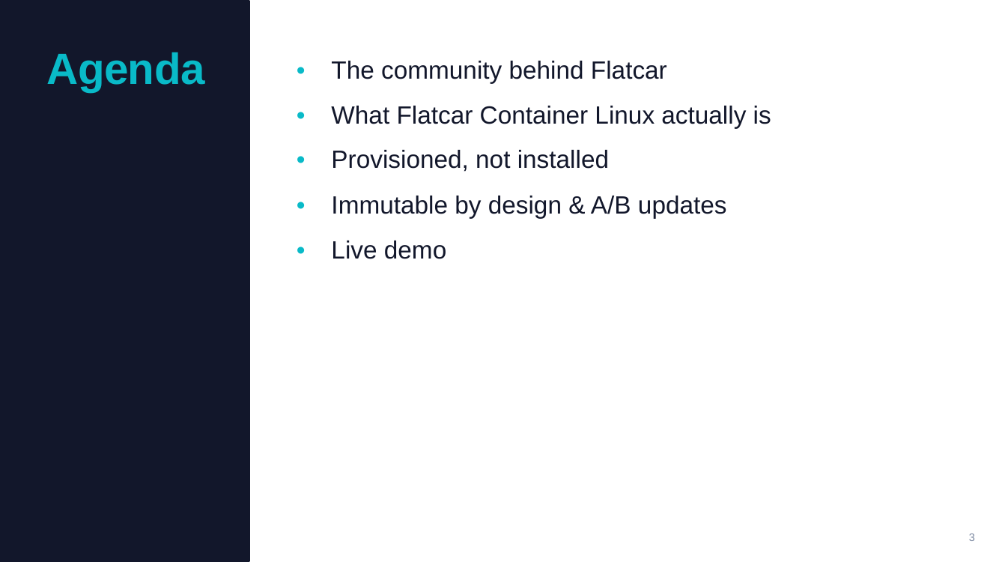
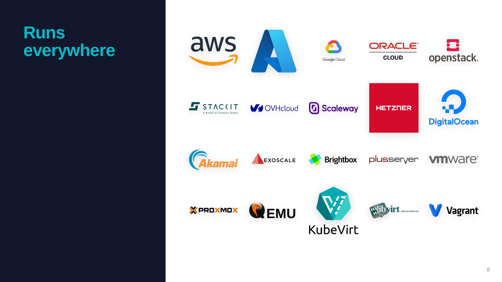
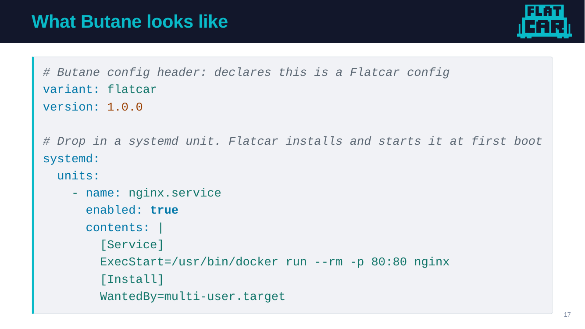
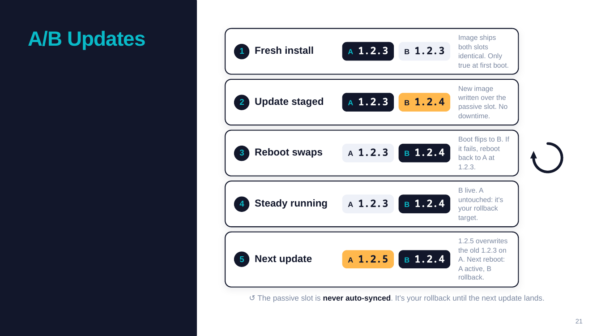
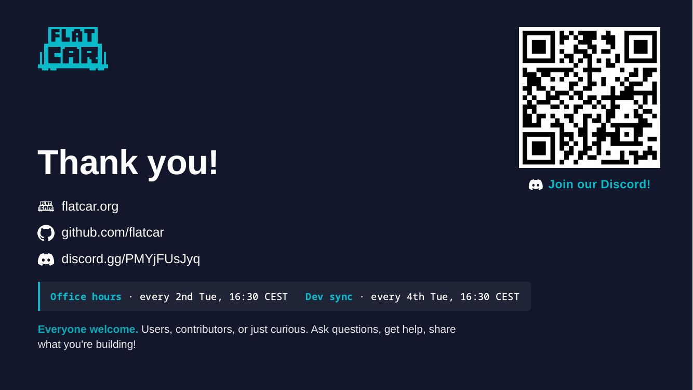

# 📑 Cookiecutter Marp Flatcar

A cookiecutter template that scaffolds a **single-deck** Flatcar Container Linux
Marp presentation. One talk = one repo. Generated projects ship with a **full,
ready-to-give Flatcar 101 talk** — the same deck used at DevOps Days Kraków
2026 — with your name, photo, and links already wired in. Keep it as-is,
tweak it, or gut it and start over. The theme, layout utilities, asset
library, and build pipeline come with it.

|                                       |                                        |                                            |
| ------------------------------------- | -------------------------------------- | ------------------------------------------ |
|   |  |  |
|     |  |  |

See **[`preview/slides.pdf`](preview/slides.pdf)** for the full rendered deck.
Run `make build` right after generation and you'll get an identical
`build/slides.pdf` with your name on the cover.

> **⚠️ Download the PDF, don't view it inline on GitHub.** GitHub's built-in
> PDF viewer drops some of the CSS-driven effects the theme relies on
> (backgrounds, `pin-*` positioning, the animated A/B update diagram,
> overlay SVGs, custom fonts, some flex/grid layouts). The PNGs above are
> the accurate reference. To see the deck exactly as it renders in Marp,
> **download `slides.pdf`** and open it in a native PDF viewer (Preview,
> Adobe, Firefox, Chrome, etc.).

## Who is this for?

**Everyone who wants to talk about Flatcar.** You don't need to be a
maintainer to use this — the template is for the whole community. That said,
the deck ships a set of maintainer headshots (sourced from LinkedIn) because:

- Flatcar maintainers are usually the ones giving Flatcar talks, so their
  photo is one click away on the whoami slide (`maintainer` prompt).
- Anyone building a "meet the team" / community slide can grab the whole set
  from `assets/photo/individual_photos/` instead of hunting down each portrait.

If you're **not** a maintainer, pick `Custom (bring your own)` (or accept the
John Doe placeholder for a quick preview) and drop your own picture in.

## What you get

A **complete Flatcar 101 deck** with your identity already filled in — ~24
slides covering the community, what Flatcar is, provisioning with Butane,
immutability, A/B updates, and channels. Structure:

1. **Cover** — talk title, subtitle, your name
2. **whoami** — your photo, role, affiliation, GitHub handle
3. **Agenda** — the five sections below
4. **Community stewarded** — CNCF governance, upstream partners, cloud
   coverage, production users (logo walls)
5. **How Flatcar Works** — the flatcar train pun, UX comparison, Butane
   config, boot-in-a-VM demo, workflow diagram
6. **Immutable by design & A/B updates** — read-only rootfs, dm-verity,
   animated A/B slot diagram, release channels
7. **Demos!** — placeholder pointing at your demos URL
8. **Closing** — thank-you slide with Flatcar community links + Discord CTA

Every slide is production-tested content you can keep, edit, or delete.
All 9 slide layouts (`cover`, `lead`, `section`, `closing`, `agenda`,
`sidebar`, `sidebar whoami`, `quote`) and every utility class (`img-*`,
`pin-*`, `pane-*`, `row`, `cols-*`, `callout`, `logo-wall`, `ab-slide`, …)
are demonstrated in the deck and documented in
[`MANUAL.md`](%7B%7B%20cookiecutter.project_slug.replace%28%27_%27%2C%20%27-%27%29%20%7D%7D/MANUAL.md).

## Full worked example

The deck this template ships is the same one delivered at DevOps Days
Kraków 2026 — _"Flatcar Linux: Provisioned, Not Installed"_
(by Jan Bronicki). A copy of the rendered PDF and source markdown lives
under [`examples/devops-days-krakow-2026/`](examples/devops-days-krakow-2026/)
so you can preview the finished result on GitHub before generating:

- **[Rendered PDF](examples/devops-days-krakow-2026/slides.pdf)** — the built
  output (6.9 MB), viewable directly on GitHub _(but see the download note
  above — GitHub's inline PDF viewer drops some CSS-driven effects;
  download the file for accurate rendering)_
- **[`slides.md`](examples/devops-days-krakow-2026/slides.md)** — the source

The full project (assets, themes, Makefile, CI) lives in its own repo:
[**John15321/devops-days-krakow-2026**](https://github.com/John15321/devops-days-krakow-2026).

## What's inside

- `slides.md` at the repo root — a full Flatcar 101 talk (cover, whoami,
  agenda, community, how-it-works, immutability + A/B updates, demos,
  closing) with your maintainer photo, name, and links already wired in
- `themes/flatcar.css` + `themes/flatcar/{base,dark,sidebar}.css` — the Flatcar
  theme with 9 slide layouts + utility classes (`img-*`, `pin-*`, `pane-*`,
  `row`, `cols-*`, `callout`, `logo-wall`, `ab-slide`, …)
- `MANUAL.md` — full authoring reference for the theme + utilities
- Podman + Make workflow, native Node.js fallback for CI
- GitHub Actions: PDF on every push, GitHub Release on `v*` tag
- Flatcar asset set: logotype, staircases, cloud/company logos, group photos, QR
- Maintainer photo set (LinkedIn-sourced) for whoami + team collages
- Closing slide auto-includes a QR code + **Join our Discord!** CTA

## Usage

### 1. Install cookiecutter

[Cookiecutter](https://cookiecutter.readthedocs.io/) is a small Python CLI that
generates a new project directory from a template like this one, answering a
short list of prompts (name, title, GitHub handle, …) and dropping a ready-to-
build repo in your current folder. You only need it once — after generation the
project is a normal git repo with a `Makefile`, no runtime dependency on
cookiecutter.

Install with `pipx` (recommended — isolates the CLI in its own venv):

```bash
pipx install cookiecutter
```

Or with `pip` / your distro package manager (`brew install cookiecutter`,
`dnf install python3-cookiecutter`, `apt install cookiecutter`). Full
instructions: [cookiecutter installation
guide](https://cookiecutter.readthedocs.io/en/latest/installation.html).

### 2. Generate your talk

```bash
cookiecutter gh:John15321/cookiecutter-marp-flatcar
cd <your-project-slug>
make setup        # one-time container image build (Podman or Docker)
make build        # → build/slides.pdf
```

The `gh:` prefix tells cookiecutter to fetch the template from GitHub. You can
also pass a local path (`cookiecutter ./cookiecutter-marp-flatcar`) if you've
cloned it. Answer the prompts (see the table below) and cookiecutter drops
your project under `./<project_slug>/`.

## Prompts

| Prompt                      | Purpose                                                                                       |
| --------------------------- | --------------------------------------------------------------------------------------------- |
| `maintainer`                | Pick a Flatcar maintainer to auto-select their photo, "Custom" to bring your own, or accept the default John Doe placeholder |
| `author_full_name`          | Speaker name (frontmatter + cover + whoami + README footer)                                   |
| `author_email`              | `package.json` author email                                                                   |
| `author_github_handle`      | GitHub handle rendered on the whoami slide                                                    |
| `author_role`               | First bio line on the whoami slide (e.g. "Flatcar Maintainer")                                |
| `author_affiliation`        | Second bio line on the whoami slide (e.g. "Software Engineer @ …")                            |
| `project_full_name`         | Human-readable talk name (README h1)                                                          |
| `project_slug`              | Auto-derived directory name (kebab-case)                                                      |
| `project_short_description` | `package.json` + README description                                                           |
| `talk_title`                | The h1 shown on the cover slide                                                               |
| `talk_subtitle`             | The h2 subtitle under the cover title                                                         |
| `demos_url`                 | URL shown on the "Demos!" slide                                                               |

## After generation

If you picked a maintainer, their portrait is already wired into the whoami
slide. If you picked "Custom", drop your portrait at
`assets/photo/individual_photos/speaker.jpg`. The default is a John Doe
placeholder — fine for a quick preview, swap it out before you present.
Either way, all shipped maintainer photos stay in that folder — handy if
you want to build a collage of the team.

```bash
make setup                  # first-time container image build (Podman)
make build                  # → build/slides.pdf
make clean                  # remove build/ and artifacts/
make watch                  # live-rebuild while editing (native, needs npm ci)
make preview                # live browser preview
make help                   # every target
```

See [`MANUAL.md`](%7B%7B%20cookiecutter.project_slug.replace%28%27_%27%2C%20%27-%27%29%20%7D%7D/MANUAL.md)
inside the generated project for the authoring reference (slide layouts,
utility classes, both HTML-class and markdown-alt-text syntaxes).

Push a `v*` tag to publish a GitHub Release with the PDF attached.

