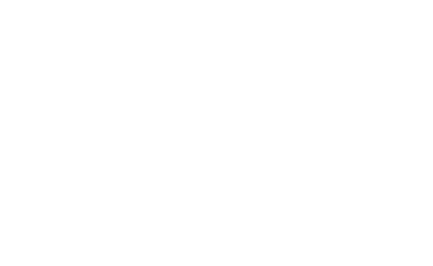

<!-- _class: cover -->
<!-- _paginate: false -->

# {{ cookiecutter.talk_title }}

## {{ cookiecutter.talk_subtitle }}

##### {{ cookiecutter.author_full_name }}

---

<!-- _class: sidebar whoami -->

# whoami

  

## {{ cookiecutter.author_full_name }}

{{ cookiecutter.author_role }}

{{ cookiecutter.author_affiliation }}




@{{ cookiecutter.author_github_handle }}

---

<!-- _class: agenda -->

# Agenda

- First topic
- Second topic
- Third topic
- Live demo

---

<!-- _class: section -->

# Section divider

## Use this to break your talk into chapters

---

<!-- Default content slide. Available layouts (set via `<!-- _class: ... -->` at the top of a slide):
     cover | lead | section | closing | agenda | sidebar | sidebar whoami | quote
     See MANUAL.md for the full theme + utility reference. -->

# Your first slide

- Replace this content with your own
- See `MANUAL.md` for layouts, utilities, and asset conventions
- Drop images into `assets/` and reference them with relative paths

---

<!-- _class: closing -->
<!-- _paginate: false -->

# Thank you!

 Join our Discord!

  <a href="https://flatcar.org"> flatcar.org</a>
  <a href="https://github.com/flatcar"> github.com/flatcar</a>
  <a href="https://discord.gg/PMYjFUsJyq"> discord.gg/PMYjFUsJyq</a>

  <strong>Office hours</strong> · every 2nd Tue, 16:30 CEST
  <strong>Dev sync</strong> · every 4th Tue, 16:30 CEST

<strong>Everyone welcome.</strong> Users, contributors, or just curious. Ask questions, get help, share what you're building!

